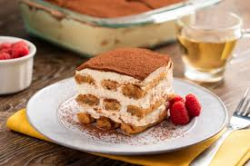

<!DOCTYPE html>
<html lang="ru">
<head>
  <meta charset="UTF-8">
  <meta name="viewport" content="width=device-width, initial-scale=1.0">
  <title>Меню Ресторана</title>
  
</head>
<body>
  <!-- Лента сверху -->
  

    Бесплатная доставка при заказе от 1000 сом! 🎉
  

  <header>
    

      <h1>Ресторан "Вкусный уголок"</h1>
    

    <nav>
      <ul>
        <li><a href="#">Главная</a></li>
        <li><a href="#">Меню</a></li>
        <li><a href="#">О нас</a></li>
        <li><a href="#">Контакты</a></li>
      </ul>
    </nav>
  </header>

  <!-- Падающие снежинки -->
  
❄

  
❄

  
❄

  
❄

  
❄

  
❄

  
❄

  <!-- Новогодняя елка -->
  
🎄

  <!-- Подарки -->
</html>

  

  

  

  <section class="menu-section">
    <h2>Наше меню</h2>
    

      

        
        <h3>Паста Карбонара</h3>
        
Паста с соусом Карбонара и пармезаном.

        500 сом
        <a href="#" class="add-to-cart">Добавить в корзину</a>
      

      

        
        <h3>Салат Цезарь</h3>
        
Свежие листья салата, курица, сыр и соус Цезарь.

        350 сом
        <a href="#" class="add-to-cart">Добавить в корзину</a>
      

      

        
        <h3>Стейк Рибай</h3>
        
Сочный стейк с гарниром и соусом.

        1200 сом
        <a href="#" class="add-to-cart">Добавить в корзину</a>
      

    

    

      

        
        <h3>Суп Борщ</h3>
        
Классический борщ с говядиной, свеклой и сметаной.

        300 сом
        <a href="#" class="add-to-cart">Добавить в корзину</a>
      

      

        
        <h3>Пицца Маргарита</h3>
        
Томаты, моцарелла, базилик, оливковое масло.

        400 сом
        <a href="#" class="add-to-cart">Добавить в корзину</a>
      

      

        
        <h3>Тирамису</h3>
        
Нежный итальянский десерт с кофе и маскарпоне.

        350 сом
        <a href="#" class="add-to-cart">Добавить в корзину</a>
      

    

  </section>

  <footer>
    
&copy; 2024 Ресторан "Вкусный уголок". Все права защищены.

  </footer>
</body>
</html>
